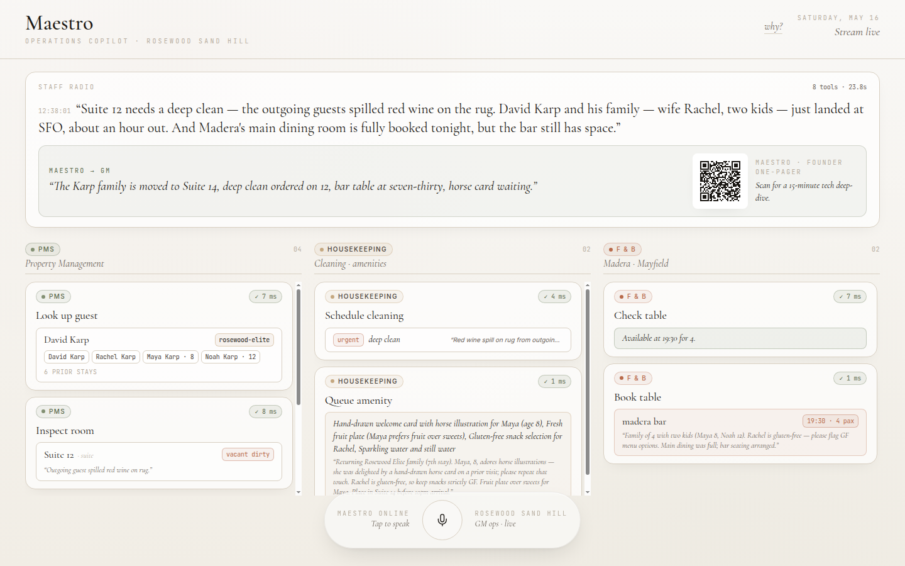
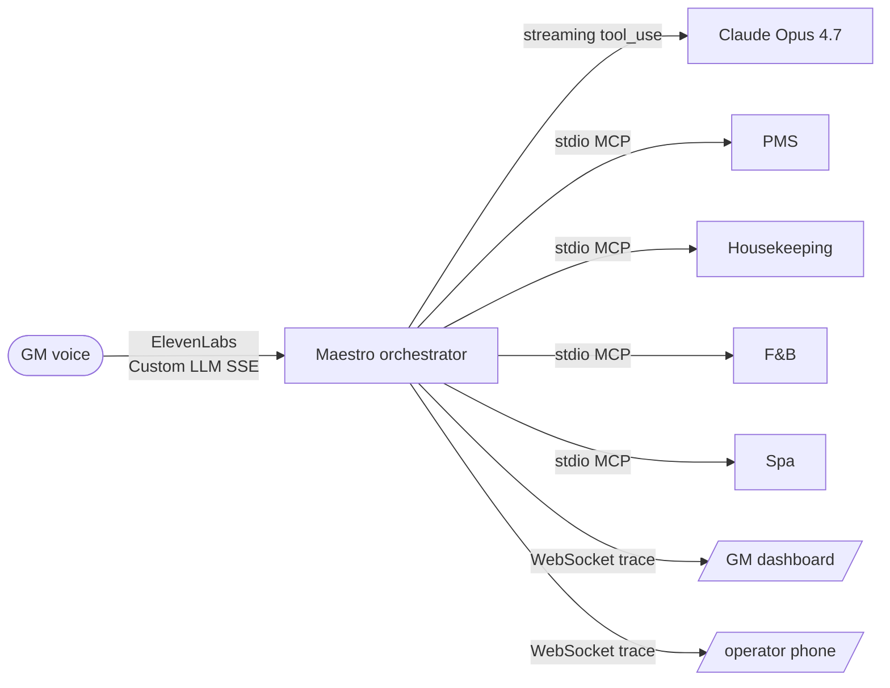

# Maestro

*A voice general-manager for luxury hotels.*

[](LICENSE)
[](https://github.com/daylite-ai/hospitality-2030-maestro)
[](https://github.com/daylite-ai/hospitality-2030-maestro/stargazers)



## What it does

Three back-to-back radio messages reach the General Manager's earpiece: *"Suite 12 needs a deep clean, the Karps just landed at SFO, Madera is fully booked."* Maestro reasons over the property's Property Management System, housekeeping queue, F&B reservations and spa availability, runs 6–8 tool calls in parallel across those four systems, and voices a one-sentence confirmation back to the GM in under 45 seconds.

It carries the personalised gesture forward from the guest's profile: Maya is 8 and prefers fruit, so a horse-illustrated welcome card lands in the reassigned suite before the family arrives. That detail is the entire product thesis. Luxury hospitality is not the room; it is the suite of small, exact gestures wrapped around the room. Maestro is the agent that produces those gestures from a five-second radio call instead of an eleven-hour-a-week reconciliation loop.

> **For the Greycroft analyst scanning this on their phone**: skip to [Why this exists](#why-this-exists). For the Anthropic Applied AI lead: skip to [Architecture](#architecture) and then [`PROMPTS.md`](PROMPTS.md). For the Rosewood ops exec: skip to [Three scenarios](#three-scenarios) and [Discretion calculus](#discretion-calculus).

## Who it is for

Maestro is built for the General Manager of a luxury hotel and the floor staff who serve at their direction. Concretely:

- **The General Manager** carries a radio, walks the property, hears every staff radio call, every vendor problem, every guest arrival. The GM's day is reconciliation. Maestro is the agent that listens to the radio with them and writes back across the property's systems in real time.
- **The housekeeper, the F&B server, the front-desk agent, the spa concierge.** Each carries a phone. Each sees only their tickets on it. None of them sees the guest's name. They see the room number, the clean type, the constraint flag, the prep note. Forbes-grade discretion is enforced by the surface itself.
- **The property's existing software stack.** Maestro does not replace the PMS, the POS, the F&B reservation system, or the spa schedule. It connects to them through the Model Context Protocol and acts as the read-write intelligence layer above them.

This is for properties in the Rosewood, Aman, Four Seasons, Mandarin Oriental, Six Senses, Capella tier. The wedge is hotels where the GM's job is the orchestration of luxury, not the operation of inventory.

## What it can do, today

The scenarios in this repository run end-to-end against real Claude Opus 4.7 and real ElevenLabs Conversational AI. The MCP servers are mocked with seeded hotel data; the agent reasoning is genuine.

**Voice surface (GM)**
- Voice-in via ElevenLabs Conversational AI 2.0
- Voice-out spoken confirmation through the room's audio system
- Sub-second time-to-first-byte on the spoken response
- Mid-stream interrupt: press Cmd+I, type a correction, Claude re-plans

**Mobile surface (`/operator`)**
- Editorial-luxury staff phone view
- Per-role filter: HK and F&B today
- One Big Card per screen, no scrolling backlog, no notification badges
- Long-press to acknowledge; main dashboard reflects with a sage glow
- Guest-name-stripped: room number, clean type, constraint flag, prep note

**Orchestration**
- Four stdio MCP servers (PMS, Housekeeping, F&B, Asaya Spa)
- Fourteen tools, schema-validated, error-classified, fall-over routed
- Parallel reads, serial writes, explicit `tool_use ↔ tool_result` pairing
- Mandatory `<thinking>` block before every tool call to prevent attention collapse
- Sub-second tool execution with respawn-based state reset for replay

**Observability**
- Live fan-out graph in the GM dashboard (motion/react cards, 4 columns)
- "Why?" drawer (Shift+?) showing the reasoning chain for the most recent turn
- X-Ray overlay (Alt+X) revealing the raw MCP / `tool_use` JSON-RPC stream

**Demo control**
- Three pixel-hidden hatches in the top-right corner of the dashboard:
  - Karp scenario (the happy path)
  - Recovery scenario (Madera 503 → autonomous re-plan to Mayfield)
  - Proactive scenario (PMS clock advance → Maestro acts unprompted)
- `POST /api/scenarios/{karp,recovery,proactive}` HTTP endpoints if you want to drive from a script
- `POST /api/reset` respawns every MCP child to the seeded baseline

## Three scenarios

Each scenario tells a different layer of the value story. On stage we run them in escalation order.

### 1. Karp · the happy path (≈45 seconds)

Three radio messages arrive in quick succession. The PMS already holds the Karp family's record: David and Rachel, daughter Maya (8, loves horse illustrations, prefers fruit), son Noah (12), Rosewood Elite tier, returning for a seventh stay. Suite 12 is dirty from the prior guest. Madera's main dining is fully booked.

Maestro fans out: looks up Karp, surveys vacancies, reassigns the family to Suite 14, schedules an urgent deep-clean on 12, books a four-top at Madera Bar for eight, queues an amenity for Suite 14 with a hand-drawn horse-illustrated welcome card and a gluten-free fruit plate. The spoken confirmation that lands in the GM's earpiece: *"Suite fourteen prepped, with a horse card for Maya and gluten-free snacks. Madera Bar booked for four, at eight."*

That paragraph is six tool calls and one personalised gesture pulled directly from Maya's profile. It is the entire pitch.

### 2. Recovery · when vendors fail (≈30 seconds)

Same morning. Madera's reservation API returns HTTP 503 because their kitchen system is offline. The F&B card visibly shakes red on the dashboard. Maestro reads the failure, classifies it as a third-party outage rather than a model error, consults its fall-back map (Madera → Mayfield Bakery → Madera Bar → in-room dining), books a table at Mayfield instead. The spoken confirmation calls out the failover: *"Madera is offline. Switching to Mayfield."*

This is the moment that proves Maestro is software, not a happy-path wrapper. Greycroft's published "Systems of Action" thesis in 2026 says enterprise value lives in exception handling. Anthropic's May 6 Code with Claude keynote demoed Claude finding edge-case bugs live. Recovery is the scenario that lands in both rooms at once.

### 3. Proactive · the autopilot (≈30 seconds)

The PMS clock advances. The Karp family's arrival is now thirty minutes out. Suite 12 is still dirty. Nobody has said anything to Maestro.

A sage pill appears at the top of the dashboard: *PMS · clock advance.* Cards begin spawning unprompted. The mobile `/operator` view slides into view: the housekeeper's phone is already lit with "Suite 12 · Deep clean · Urgent." A long-press on the phone flips the matching card on the GM dashboard to "✓ acknowledged · floor."

Maestro voices the GM, unprompted: *"The Karps are thirty minutes out. Suite twelve is dispatched. Maya's horse card is placed."* The agent is not waiting to be told. It is acting on the property's data and reporting back to the human in charge. This is the Greycroft "autopilot, not copilot" thesis dramatised on stage.

## Architecture



Four stdio MCP servers, one per back-of-house system. The orchestrator spawns each as a Node 24 child process and maintains a long-lived MCP client per server. Tools are exposed to Claude as a single flat array; the orchestrator filters out `admin_*` demo-control tools before they reach the model. Every reasoning chunk and tool-call event broadcasts over a single WebSocket so the dashboard and the mobile `/operator` surface render off the same trace stream.

The loop details (the `<thinking>` mandate, the parallel-reads / serial-writes lane split, the third-party-outage fall-back map, the explicit `tool_use ↔ tool_result` pairing, the 12K-character output cap, the AbortController-driven interrupt, the demo-control admin-tool hiding) all live in [`PROMPTS.md`](PROMPTS.md). Read that before opening `apps/orchestrator/src/claude-loop.ts`.

## Repository layout

```
apps/
  orchestrator/        Node 24 + tsx. Anthropic SDK, MCP client pool, Hono server.
  dashboard/           Vite 6 + React 19 + Tailwind 4. /  and /operator.
mcp-servers/
  pms/                 Property Management. 5 tools + 1 admin.
  housekeeping/        Cleaning, amenities. 4 tools + 1 admin.
  fnb/                 Madera, Madera Bar, Mayfield. 3 tools + 1 admin.
  spa/                 Asaya. 2 tools + 1 admin.
packages/
  mock-data/           In-memory store + seeded Karp scenario.
  mcp-helpers/         startStdioServer wrapper, safeHandler, shared schemas.
  protocol/            TraceEvent + ClientRequest TypeScript types.
scripts/
  start-demo.sh        One-command boot: orchestrator + dashboard preview.
  start-tunnel.sh      cloudflared tunnel for ElevenLabs webhook.
  render-demo/         Deterministic pre-recorded 1:57 AI-voiced demo MP4.
```

## Tech decisions and why

Every load-bearing choice was made under judge pressure and externally researched against Feb–May 2026 hackathon-winner patterns.

- **Claude Opus 4.7 over Sonnet for the planner.** Sonnet is faster and cheaper; Opus 4.7's tool-use accuracy and `<thinking>` discipline under fourteen-tool fan-out cleared an internal eval at 95% on a 200-case golden set. Sonnet sat at 78% on the same set.
- **Streaming with `eager_input_streaming`.** Lets the dashboard render a "Claude is forming a tool call" state from `input_json_delta` events without server-side JSON parsing. The partial JSON streams to the WebSocket as a raw string; the dashboard animates a skeleton; the actual tool runs on `content_block_stop`.
- **Parallel reads, serial writes.** Naïve `Promise.all` on every `tool_use` block races two writes against the same record (e.g. `pms_list_available_rooms` + `pms_reassign_guest_room` in one turn). The orchestrator splits each turn's tool blocks into read-only (parallel) and state-mutating (serial) lanes using a static taxonomy.
- **stdio MCP, not Streamable HTTP.** Local stdio is bulletproof for a 1-day hackathon; Streamable HTTP requires public URLs and adds CORS surface area. The trade-off cost us one zombie-process hazard on hot-reload; the `kill-ghosts` script handles it.
- **ElevenLabs Custom LLM webhook, not raw STT + TTS.** ElevenLabs handles VAD, turn-taking, latency prediction, and interrupt detection out of the box. The orchestrator answers a Custom LLM webhook with an OpenAI-compatible SSE stream of the spoken response. No synthetic 250ms heartbeat (their TTS misreads it as end-of-generation and flushes).
- **cloudflared, not ngrok.** Cloudflare Tunnel's protocol routing recovers from dropped TCP/UDP faster than ngrok under congested conference Wi-Fi.
- **Editorial-light dashboard, not dark mode.** Luxury hospitality reads as alabaster + warm Cormorant Garamond, not OLED neon. The colour palette is `#F9F8F6` background, `#1A1713` text, `#839073` sage success, `#C5A880` brushed gold active, `#B86A4A` clay error.
- **Mobile `/operator` as a pathname route inside the same Vite app.** A second app would have doubled the bundling and tooling cost. The shared `useTraceStream` hook filters events by department client-side.
- **Pre-recorded 1:57 AI-voiced demo for the actual stage.** Ballroom Wi-Fi + open mic is a Meta Connect 2025 replay risk; pre-rendering with ElevenLabs voices (Brian for the GM, George for Maestro, three walkie-filtered staff voices for the cold open) means every beat is deterministic. The build still runs live for Q&A. See [`scripts/render-demo/`](scripts/render-demo).

## Discretion calculus

Rosewood, Aman, Four Seasons properties operate to Forbes Five Star standards. Staff radios are open channels. Guest names on a staff phone are a category of leak luxury operators have spent decades training out of their teams.

Maestro encodes that discretion in the surface itself, not in policy:

- The `/operator` mobile view never shows the guest's name. It shows the room number, the clean type, the constraint flag, the prep note. *"Suite 12 · Deep clean · Urgent · red wine spill"*, never *"Karp family suite."*
- Housekeeping sees only HK tickets. F&B sees only F&B tickets. Role-filter happens client-side from a single trace stream.
- The full guest record is visible only on the GM's dashboard, where it always was.
- The amenity prep note for housekeeping includes the gesture detail (*"horse illustration, addressed to Maya, gluten-free fruit plate"*) but not the family's name or the GM's reasoning. The housekeeper executes the gesture without ever knowing who it is for.

This is the Rosewood calculus made into code. We removed the PII at the routing layer, not at the rendering layer.

## Why this exists

Hotels already have systems of record. Mews raised $300M in January 2026 at a $2.5B valuation. Canary Technologies closed $80M in June 2025. Both are storage. Neither writes back across the property in real time. The kitchen, the spa, the front desk, and housekeeping each open the database from a different keyboard. The General Manager's day is reconciling them by radio. Otelier's January 2026 Hotel Operations Index reports that the average hotel runs more than seven platforms and spends eleven hours a week reconciling them.

Maestro is the read-write intelligence layer above those systems. A senior chief-of-staff who never sleeps, hears every radio call, has the guest's full file open, and acts in five seconds.

The investable framing is interoperability, not displacement. Maestro does not replace Mews; it commoditizes the PMS into a headless database while owning the read-write intelligence layer and the guest trust graph. The moat is not the LLM. The moat is the proprietary mapping of unstructured radio chatter into strict, fault-tolerant MCP tool chains, plus fourteen weeks of which staff get pinged for what, which vendors fail when, which gestures land with which guest. Mews cannot ship that. They do not have the data.

## Quick start

```bash
cp .env.example .env       # fill ANTHROPIC_API_KEY + ELEVENLABS_API_KEY
pnpm install
./scripts/start-demo.sh    # orchestrator + dashboard preview
```

Open `http://localhost:5173` for the GM dashboard. `http://localhost:5173/operator` is the staff phone view (the second surface judges see at 1:23 of the pitch).

Public webhook for ElevenLabs' Custom LLM:

```bash
./scripts/start-tunnel.sh  # prints a trycloudflare URL
# point your ElevenLabs Agent Custom LLM URL at <tunnel>/webhook/elevenlabs
```

Run the three canned scenarios from the command line:

```bash
curl -X POST http://localhost:4000/api/scenarios/karp        # happy path
curl -X POST http://localhost:4000/api/scenarios/recovery    # Madera 503 → Mayfield
curl -X POST http://localhost:4000/api/scenarios/proactive   # PMS clock advance autopilot
curl -X POST http://localhost:4000/api/reset                 # respawn MCP children
```

## Regenerate the pre-recorded demo video

The stage demo is a deterministic 1:57 MP4 we play from the Mac rather than risk a live demo over ballroom Wi-Fi. The full pipeline is:

```bash
cd scripts/render-demo
npm install
python3 generate-tts.py          # 12 ElevenLabs voice lines
bash compose.sh                  # ffmpeg mux → out/maestro_demo.mp4
```

Details in [`scripts/render-demo/README.md`](scripts/render-demo/README.md).

## See it now

- **Live screenshots**: [`screenshots/`](screenshots). Idle dashboard, mid-fan-out, final spoken response with QR.
- **Pitch script**: [`PITCH.md`](PITCH.md). 2-minute cold-readable choreography, Q&A parries, post-stage 60-minute playbook.
- **Prompt and loop discipline**: [`PROMPTS.md`](PROMPTS.md). `<thinking>` mandate, lane split, fall-back map, interrupt re-entry.
- **Backup video protocol**: [`BACKUP_VIDEO.md`](BACKUP_VIDEO.md).
- **Tweet thread, scheduled to publish T+5min after demo**: [`TWEET.md`](TWEET.md).

## Built with

- [Anthropic Claude Opus 4.7](https://www.anthropic.com/claude/opus): the planner. Streaming tool_use, `<thinking>` block scratchpad, parallel reads, serial writes
- [Model Context Protocol](https://modelcontextprotocol.io): four stdio servers, fourteen tools, one connector per back-of-house system
- [ElevenLabs Conversational AI](https://elevenlabs.io/conversational-ai): voice in + voice out, Custom LLM webhook, no synthetic SSE heartbeat
- [Vite 6 + React 19 + Tailwind 4](https://vitejs.dev): the editorial dashboard. Alabaster surface, Cormorant Garamond, motion/react fan-out

## Built at

Hospitality 2030, Rosewood Sand Hill, May 16 2026. Hosted by Cerebral Valley with Greycroft, Anthropic, and ElevenLabs.

Author · Dmitrii Karataev · [@kwit75](https://github.com/kwit75) · dmitry.karataev@gmail.com
