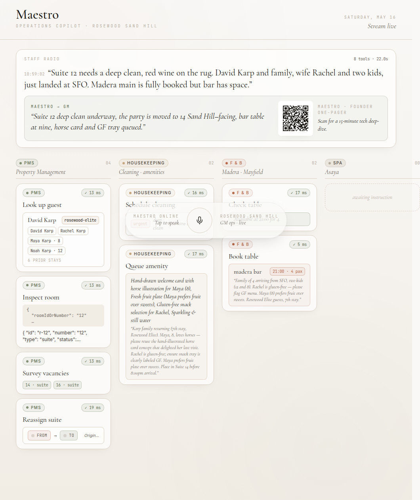

# Maestro

*A voice general-manager for luxury hotels.*

[](LICENSE)
[](https://github.com/daylite-ai/hospitality-2030-maestro)
[](https://github.com/daylite-ai/hospitality-2030-maestro/stargazers)



## What it does

Three back-to-back radio messages reach the GM's earpiece: "Suite 12 needs a deep clean, the Karps just landed at SFO, Madera is fully booked." Maestro reasons over the property's Property Management System, housekeeping queue, F&B reservations and spa availability, runs 6–8 tool calls in parallel, and voices a one-sentence confirmation back to the GM in 45 seconds. It carries the personalised gesture forward from the guest's profile: Maya is 8 and prefers fruit, so a horse-illustrated welcome card lands in the reassigned suite before the family arrives.

## See it now

- **Live screenshots**: [`screenshots/`](screenshots) — idle, mid-fan-out, final spoken response with QR
- **Pitch script**: [`PITCH.md`](PITCH.md) — 2-minute cold-readable, with Greycroft framing + memorised Q&A
- **Prompt + loop discipline**: [`PROMPTS.md`](PROMPTS.md) — `<thinking>` blocks, parallel reads, serial writes, recovery fall-back map
- **Backup video protocol**: [`BACKUP_VIDEO.md`](BACKUP_VIDEO.md)
- **Tweet thread (scheduled T+5min)**: [`TWEET.md`](TWEET.md)

## Architecture


Four stdio MCP servers, 14 tools, sequential state-mutation discipline, AbortController-driven barge-in. The orchestrator maintains an MCP client per server, exposes a flat tool array to Claude, intercepts each `tool_use` block, routes it through the right MCP client, and streams every reasoning + tool-call event over WebSocket so the dashboard renders a live fan-out.

The loop details live in [`PROMPTS.md`](PROMPTS.md).

## Why this exists

Hotels already have systems of record. Mews raised $300M in January 2026 at a $2.5B valuation; Canary closed $80M in June 2025. Both are storage. Neither writes back across the property in real time. The kitchen, the spa, the front desk and housekeeping each open the database from a different keyboard, and the GM's day is reconciling them by radio. Otelier's January 2026 index reports the average hotel runs more than seven platforms and spends eleven hours a week reconciling them.

Maestro is the read-write intelligence layer above those systems. A senior chief-of-staff who never sleeps, hears every radio call, has the guest's full file open, and acts in five seconds.

## Quick start

```bash
cp .env.example .env       # fill ANTHROPIC_API_KEY + ELEVENLABS_API_KEY
pnpm install
./scripts/start-demo.sh    # orchestrator + dashboard preview
```

Open `http://localhost:5173` for the GM dashboard. `http://localhost:5173/operator` is the staff phone view (the second surface judges see at 1:40 of the pitch).

Public webhook for ElevenLabs' Custom LLM:

```bash
./scripts/start-tunnel.sh  # prints a trycloudflare URL
# point your ElevenLabs Agent Custom LLM URL at <tunnel>/webhook/elevenlabs
```

## Built with

- [Anthropic Claude Opus 4.7](https://www.anthropic.com/claude/opus): the planner. Streaming tool_use, `<thinking>` block scratchpad, parallel reads, serial writes
- [Model Context Protocol](https://modelcontextprotocol.io): four stdio servers, fourteen tools, one connector per back-of-house system
- [ElevenLabs Conversational AI](https://elevenlabs.io/conversational-ai): voice in + voice out, Custom LLM webhook, no synthetic SSE heartbeat
- [Vite 6 + React 19 + Tailwind 4](https://vitejs.dev): the editorial dashboard. Alabaster surface, Cormorant Garamond, motion/react fan-out

## Built at

Hospitality 2030, Rosewood Sand Hill, May 16 2026. Hosted by Cerebral Valley with Greycroft, Anthropic, and ElevenLabs.

Author · Dmitrii Karataev · [@kwit75](https://github.com/kwit75) · dmitry.karataev@gmail.com
